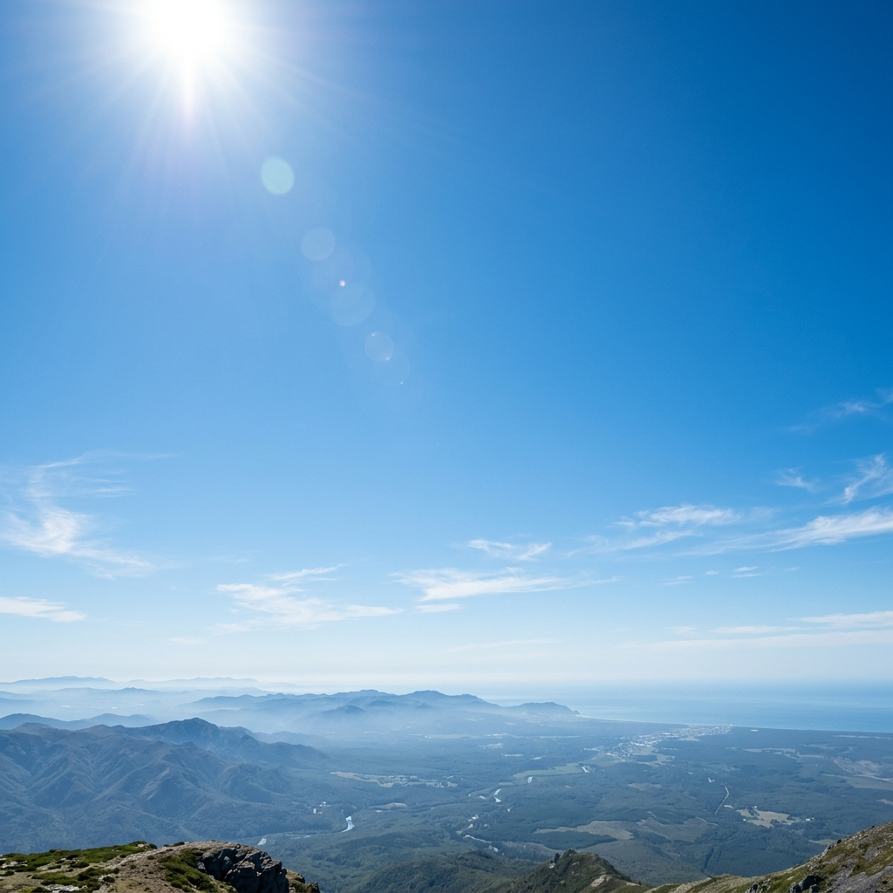
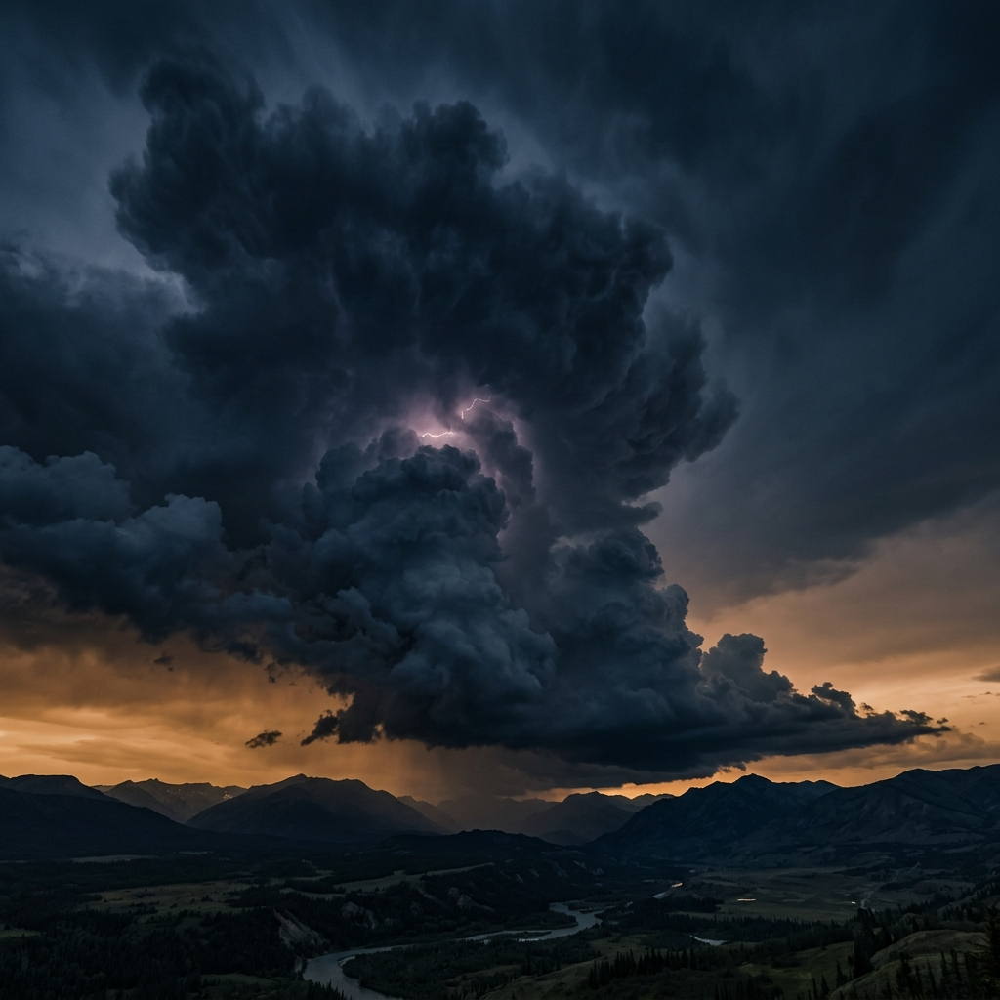
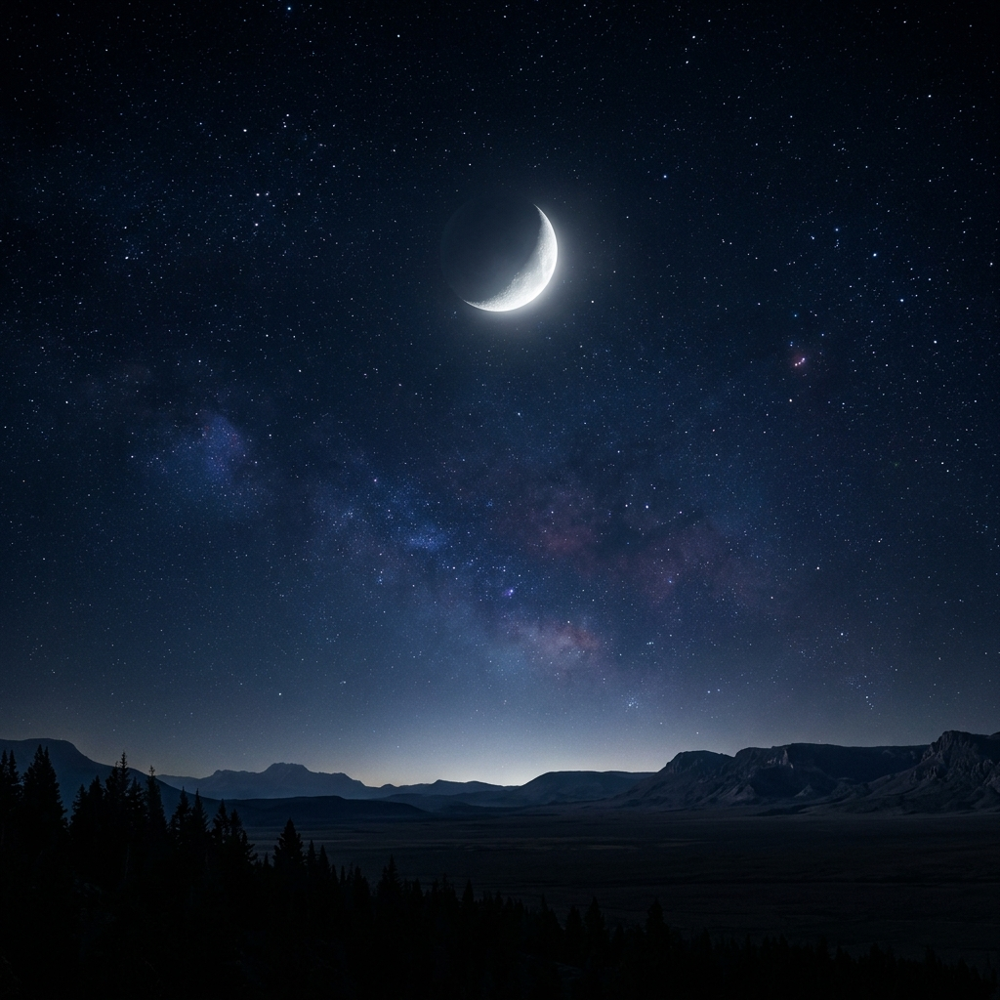

# 🌌 AuraWeather: Cinematic Weather Dashboard

<div align="center">
  

  <p align="center">
    <strong>Experience weather like never before.</strong>
    <br />
    A premium, high-end dashboard combining real-time meteorological intelligence with cinematic visual storytelling.
  </p>

  [](https://reactjs.org/)
  [](https://www.typescriptlang.org/)
  [](https://vitejs.dev/)
  [](https://www.framer.com/motion/)
  [](https://tailwindcss.com/)

</div>

---

## 🎭 The Cinematic Experience

AuraWeather isn't just a data panel; it's an atmospheric immersion.

- **🎞️ Cinematic Backgrounds**: Features high-resolution, locally-hosted atmospheric visuals that change dynamically based on weather codes and time-of-day (Sunset, Sunrise, Night, Day).
- **🌊 Professional Multi-Layer Animations**: 
    - **Rain**: 3-layer depth with foreground splashes, mid-rain, and background mist.
    - **Snow**: Triple-layered snowfall with wind sway, blurring, and ground shimmer.
    - **Thunderstorm**: High-intensity rain combined with volumetric lightning flashes and bolts.
    - **Mist/Fog**: Multi-directional rolling fog layers for true atmospheric depth.
    - **Sunny Glow**: Pulsing golden hour glow with rotating light rays.
- **🧊 Advanced Glassmorphism**: A state-of-the-art UI system built with complex backdrop filters, subtle gradients, and premium typography.

---

## 🧠 Core Intelligence

- **🌍 Global Geo-Intelligence**: Powered by the Open-Meteo API for real-time global weather data without the need for API keys.
- **🕒 Time-Aware UI**: Automatically detects the searched city's sunrise/sunset times to shift the visual mood (e.g., transitioning to a Starry Night or a Golden Sunset).
- **📈 High-Precision Analytics**: Responsive temperature trend charts using Recharts with a custom wavy basis-type visualization.
- **🛡️ Biometric Status Alerts**: A smart "Status" module that analyzes UV Index and Humidity to provide health and comfort recommendations.
- **📜 Smart Search History**: Quickly toggle between your last 10 searched cities with a dedicated high-end modal interface.

---

## 🛠 Tech Stack

- **Core**: React 18, TypeScript, Vite
- **Animations**: Framer Motion (Orchestration & Particle Effects)
- **Charts**: Recharts (Custom SVG Visuals)
- **Icons**: Lucide React
- **Styles**: PostCSS & Tailwind CSS (Custom Design Tokens)
- **Data**: Open-Meteo Geocoding & Forecast APIs

---

## 🚀 Getting Started

### Prerequisites
- Node.js (v18 or higher)
- npm or yarn

### Installation
1. **Clone the repository**
   ```bash
   git clone https://github.com/mert00213/AuraWeather.git
   cd AuraWeather
   ```

2. **Install dependencies**
   ```bash
   npm install
   ```

3. **Launch the Cinematic Experience**
   ```bash
   npm run dev
   ```

---

## 🌌 Visual Gallery

<div align="center">
  <table style="width: 100%; border-collapse: collapse; border: none;">
    <tr>
      <td style="width: 50%; padding: 5px;"></td>
      <td style="width: 50%; padding: 5px;"></td>
    </tr>
    <tr>
      <td style="width: 50%; padding: 5px;"></td>
      <td style="width: 50%; padding: 5px;"></td>
    </tr>
  </table>
</div>

---

<div align="center">
  Developed with ❤️ by <strong>Mert İlhan Dündar</strong>. 
  <br />
  AuraWeather is open for contributions and meteorological exploration.
</div>
